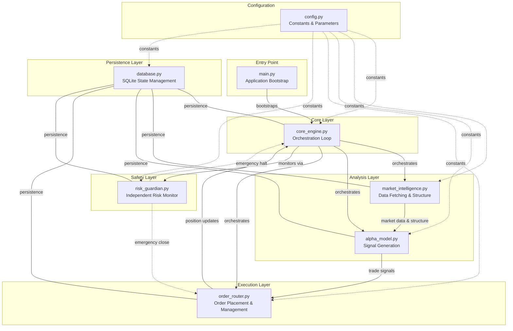
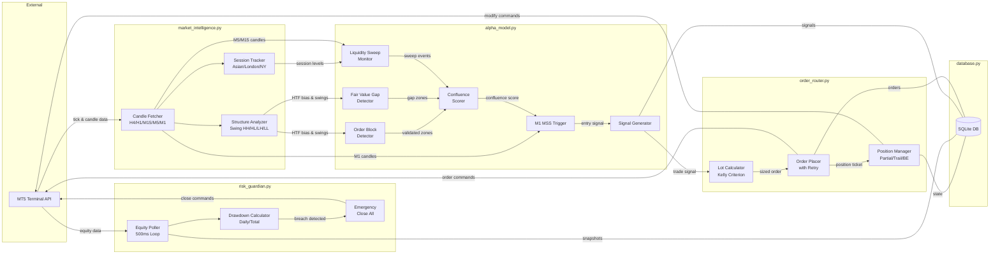
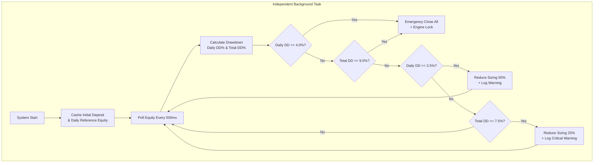

# XAUUSD Institutional Trading System - EARS Requirements Specification

## Document Control

| Field | Value |
|-------|-------|
| Version | 1.0.0 |
| Status | Draft |
| Target Platform | MetaTrader 5 (Windows VM) |
| Language | Python 3.11+ |
| Symbol | XAUUSD (Gold/USD) |

---

## Table of Contents

1. [EARS Notation User Stories](#1-ears-notation-user-stories)
2. [System Architecture Map](#2-system-architecture-map)
3. [Data Flow Diagram](#3-data-flow-diagram)
4. [Discrete Execution Task Sequence](#4-discrete-execution-task-sequence)
5. [Module Interface Contracts](#5-module-interface-contracts)

---

## 1. EARS Notation User Stories

> EARS (Easy Approach to Requirements Syntax) uses structured patterns:
> - **Ubiquitous**: The system shall [action]
> - **Event-driven**: **When** [trigger], the system shall [action]
> - **State-driven**: **While** [state], the system shall [action]
> - **Option**: **Where** [feature], the system shall [action]
> - **Unwanted behavior**: **If** [condition], **then** the system shall [action]

---

### 1.1 Pillar A: Smart Money Confluence Alpha Model

#### 1.1.1 Multi-Timeframe Structure Analysis (H1/H4)

| ID | Requirement |
|----|-------------|
| SMC-001 | **When** the system starts a new analysis cycle, the system shall fetch H4 candle data (minimum 200 bars) and determine the dominant trend direction by identifying the most recent valid swing high/swing low sequence. |
| SMC-002 | **When** the H4 structure is classified (bullish/bearish/ranging), the system shall fetch H1 candle data (minimum 200 bars) and confirm or deny alignment with the H4 bias. |
| SMC-003 | **While** H4 bias is bullish and H1 structure confirms higher-highs/higher-lows, the system shall only permit long entry signals from the alpha model. |
| SMC-004 | **While** H4 bias is bearish and H1 structure confirms lower-highs/lower-lows, the system shall only permit short entry signals from the alpha model. |
| SMC-005 | **If** H1 structure contradicts H4 bias, **then** the system shall suppress all trade signals until alignment is restored or a valid Break of Structure (BOS) is confirmed on H1. |

#### 1.1.2 Order Block Detection with Volume Validation

| ID | Requirement |
|----|-------------|
| SMC-006 | **When** a new H1/H4 candle closes, the system shall scan for Order Block (OB) formations defined as the last opposing candle before an impulsive move that broke structure. |
| SMC-007 | **When** an Order Block candidate is detected, the system shall validate it by confirming the impulsive leg displacement exceeds 2x the Average True Range (ATR-14) of the detection timeframe. |
| SMC-008 | **When** an Order Block is validated, the system shall verify volume at the OB candle is at minimum 1.5x the 20-period volume moving average on that timeframe. |
| SMC-009 | **While** price is approaching a validated unmitigated Order Block, the system shall flag the zone as a potential entry area and pass it to the signal evaluation pipeline. |
| SMC-010 | **If** an Order Block is fully mitigated (price traded through the entire zone body), **then** the system shall remove it from the active zones list and log the mitigation event. |

#### 1.1.3 Fair Value Gap (FVG) Detection

| ID | Requirement |
|----|-------------|
| SMC-011 | **When** a new candle closes on M15/H1/H4 timeframes, the system shall scan for Fair Value Gaps defined as a three-candle pattern where Candle 1 high < Candle 3 low (bullish FVG) or Candle 1 low > Candle 3 high (bearish FVG). |
| SMC-012 | **When** an FVG is detected, the system shall record its upper boundary, lower boundary, midpoint (consequent encroachment), and originating timeframe. |
| SMC-013 | **While** an FVG remains unfilled (price has not returned to at least the 50% midpoint), the system shall maintain it as an active institutional reference zone. |
| SMC-014 | **If** price fills an FVG beyond 75% of its range, **then** the system shall mark the FVG as mitigated and remove it from the active confluence zones. |

#### 1.1.4 Asian Session Liquidity Sweep Monitoring (M5/M15)

| ID | Requirement |
|----|-------------|
| SMC-015 | **When** the Asian session ends (00:00-08:00 GMT), the system shall record the session high and session low as liquidity targets. |
| SMC-016 | **When** price during the London or NY session sweeps beyond the Asian session high or low by at least 5 pips on M5/M15, the system shall flag a liquidity sweep event. |
| SMC-017 | **When** a liquidity sweep is flagged, the system shall confirm it by verifying the sweep candle exhibits a wick-to-body ratio >= 2:1 (wick outside range, body rejected back inside). |
| SMC-018 | **If** a valid Asian liquidity sweep is confirmed with body rejection, **then** the system shall generate a sweep_signal and pass it to confluence evaluation alongside OB/FVG zones. |

#### 1.1.5 M1 Market Structure Shift (MSS) Execution Trigger

| ID | Requirement |
|----|-------------|
| SMC-019 | **While** a confluence zone is active (OB + FVG overlap + sweep confirmation), the system shall begin monitoring M1 candles for a Market Structure Shift. |
| SMC-020 | **When** M1 price breaks a recent swing high (for longs) or swing low (for shorts) with displacement (candle body >= 70% of total range), the system shall confirm a valid MSS. |
| SMC-021 | **When** a valid MSS is confirmed within an active confluence zone, the system shall immediately generate a trade entry signal with: direction, entry_price, stop_loss (beyond the MSS origin), and confluence_score. |
| SMC-022 | **If** the MSS candle displacement is less than 70% body-to-range ratio, **then** the system shall discard the signal as insufficient displacement and wait for the next valid shift. |

---

### 1.2 Pillar B: Max-Profit Dynamic Lot Calculation

#### 1.2.1 Fractional Kelly Criterion Sizing

| ID | Requirement |
|----|-------------|
| SMC-023 | **When** a trade signal is generated, the system shall calculate the optimal lot size using Fractional Kelly Criterion: f* = (W * B - L) / B, where W = historical win rate, L = 1 - W, B = average win / average loss (profit factor proxy). |
| SMC-024 | **When** the Kelly fraction is computed, the system shall apply a fractional multiplier of 0.25 (quarter-Kelly) to reduce variance while maintaining positive expectancy. |
| SMC-025 | **While** the account is in a prop-firm challenge phase, the system shall enforce a hard cap of 0.5% account equity risk per trade regardless of Kelly output. |
| SMC-026 | **If** the Kelly formula returns a negative or zero value (indicating negative expectancy), **then** the system shall refuse to place the trade and log a negative_expectancy warning. |

#### 1.2.2 Partial Close at 1:1.5 Risk-Reward

| ID | Requirement |
|----|-------------|
| SMC-027 | **When** an open position reaches 1.5x the initial risk distance in profit, the system shall close 50% of the position volume. |
| SMC-028 | **When** the partial close is executed, the system shall log the partial_close event with ticket, closed_volume, remaining_volume, realized_pnl, and timestamp. |
| SMC-029 | **If** the partial close order fails due to requote or insufficient volume granularity, **then** the system shall retry with adjusted volume (rounded to nearest valid lot step) after a 500ms delay. |

#### 1.2.3 Break-Even Modification with Commission Buffer

| ID | Requirement |
|----|-------------|
| SMC-030 | **When** the 50% partial close is confirmed, the system shall immediately modify the remaining position stop-loss to entry_price + commission_buffer (calculated as round-trip spread + commission per lot in price units). |
| SMC-031 | **When** calculating the commission buffer, the system shall use: buffer = (spread_points + 2 * commission_per_lot_in_points) converted to price distance. |
| SMC-032 | **If** the break-even modification fails, **then** the system shall retry up to 3 times with exponential backoff (500ms, 1000ms, 2000ms) before logging a critical_modification_failure alert. |

#### 1.2.4 Remaining Position Rides to Extended Target

| ID | Requirement |
|----|-------------|
| SMC-033 | **While** the remaining 50% position is active with break-even stop, the system shall trail the stop-loss using M15 swing structure (below/above the most recent valid swing). |
| SMC-034 | **When** price reaches the 1:4 risk-reward target, the system shall tighten the trailing stop to the most recent M5 swing point. |
| SMC-035 | **When** price reaches the 1:5 risk-reward target, the system shall close the remaining position entirely and log the full_target_reached event. |
| SMC-036 | **If** the trailing stop is hit before the extended target, **then** the system shall close the position at market and log the exit with trail_stop_exit reason. |

---

### 1.3 Pillar C: Air-Gapped Risk Guardian

#### 1.3.1 500ms Equity Polling Background Loop

| ID | Requirement |
|----|-------------|
| SMC-037 | **When** the system starts, the Risk Guardian shall launch an independent background thread/task that polls account equity from MT5 every 500 milliseconds. |
| SMC-038 | **While** the Risk Guardian is running, it shall maintain a local cache of: current_equity, start_of_day_equity, initial_deposit, peak_equity, and last_poll_timestamp. |
| SMC-039 | **If** the equity poll fails (connection timeout or error), **then** the Risk Guardian shall log the failure and immediately attempt reconnection before the next 500ms cycle. |

#### 1.3.2 Daily 4.0% Max Loss Enforcement

| ID | Requirement |
|----|-------------|
| SMC-040 | **When** the broker daily rollover occurs (00:00 GMT), the system shall cache the equity value at that exact moment as the daily_reference_equity for the new trading day. |
| SMC-041 | **While** the trading day is active, the Risk Guardian shall calculate daily_drawdown_pct = (daily_reference_equity - current_equity) / daily_reference_equity * 100 on every poll cycle. |
| SMC-042 | **If** daily_drawdown_pct reaches or exceeds 4.0%, **then** the Risk Guardian shall immediately trigger the emergency_close_all procedure and lock the trading engine for the remainder of the day. |
| SMC-043 | **When** daily_drawdown_pct reaches 3.5% (warning threshold), the system shall log a daily_drawdown_warning and reduce position sizing to 50% of normal for any new signals. |

#### 1.3.3 Total 9.0% Drawdown Absolute Barrier

| ID | Requirement |
|----|-------------|
| SMC-044 | **When** the system first initializes, it shall record the initial_deposit value from the account and persist it in the database as the absolute reference for total drawdown calculation. |
| SMC-045 | **While** the system is operational, the Risk Guardian shall calculate total_drawdown_pct = (initial_deposit - current_equity) / initial_deposit * 100 on every poll cycle. |
| SMC-046 | **If** total_drawdown_pct reaches or exceeds 9.0%, **then** the Risk Guardian shall trigger emergency_close_all, cancel all pending orders, lock the trading engine permanently, and log a critical_total_drawdown_breach event. |
| SMC-047 | **When** total_drawdown_pct reaches 7.5% (critical warning threshold), the system shall reduce all position sizing to 25% of normal and log a total_drawdown_critical_warning. |

#### 1.3.4 Emergency Close All Procedure

| ID | Requirement |
|----|-------------|
| SMC-048 | **When** emergency_close_all is triggered, the system shall: (1) close all open positions at market price, (2) cancel all pending orders, (3) set engine_locked = True, (4) persist the lock state to database, (5) send a critical alert log. |
| SMC-049 | **If** any position close fails during emergency_close_all, **then** the system shall retry that specific position close up to 5 times with 200ms intervals before logging an emergency_close_failure for manual intervention. |
| SMC-050 | **While** engine_locked is True, the system shall reject all new trade signals and order requests regardless of their source. |

---

### 1.4 Pillar D: VM Persistence and Fault Tolerance

#### 1.4.1 SQLite State Tracking

| ID | Requirement |
|----|-------------|
| SMC-051 | **When** the system initializes, it shall create or connect to the SQLite database and verify the schema contains tables: positions, equity_snapshots, trade_history, system_state, daily_reference. |
| SMC-052 | **When** a new position is opened, the system shall insert a record with: magic_number, ticket, symbol, direction, lot_size, entry_price, stop_loss, take_profit, trailing_state, lot_multiplier, open_time, confluence_score. |
| SMC-053 | **While** positions are open, the system shall update the database record on every state change: partial_close, stop_modification, trailing_update, or close. |
| SMC-054 | **When** the equity poll completes, the system shall insert an equity_snapshot record every 30 seconds (every 60th poll) with: timestamp, equity, balance, margin_used, daily_dd_pct, total_dd_pct. |

#### 1.4.2 Reconnection on Reboot with Zero Orphaned Positions

| ID | Requirement |
|----|-------------|
| SMC-055 | **When** the system starts and detects existing records in the positions table with status = open, it shall perform a reconciliation against MT5 live positions using magic_number matching. |
| SMC-056 | **When** reconciliation finds a database position not present in MT5, the system shall mark it as orphaned_closed, query MT5 history for the close details, and update the record. |
| SMC-057 | **When** reconciliation finds an MT5 position not present in the database, the system shall create a database record for it and assign monitoring (assuming it was opened by this system based on magic_number). |
| SMC-058 | **If** reconciliation completes with all positions accounted for, **then** the system shall resume normal operation and log a successful_reconnection event with position count. |

#### 1.4.3 Exponential Backoff Retry for Orders

| ID | Requirement |
|----|-------------|
| SMC-059 | **When** an order placement fails with a retryable error (requote, timeout, trade_context_busy), the system shall retry with exponential backoff: delays of 500ms, 1000ms, 2000ms, 4000ms, 8000ms (max 5 retries). |
| SMC-060 | **If** all retry attempts are exhausted, **then** the system shall log an order_placement_failed event with the full error history and skip the trade signal. |
| SMC-061 | **When** a requote is received, the system shall refresh the current price from MT5 and resubmit with the updated price within the configured slippage tolerance. |

#### 1.4.4 Requote/Slippage Handling with Dynamic Deviation

| ID | Requirement |
|----|-------------|
| SMC-062 | **While** the current time is within NY/London session overlap (13:00-17:00 GMT), the system shall increase the allowed deviation/slippage parameter to 30 points (from default 10 points). |
| SMC-063 | **When** submitting an order, the system shall set the deviation parameter based on current session volatility: default 10 points, London 15 points, NY 20 points, overlap 30 points. |
| SMC-064 | **If** slippage on a fill exceeds the configured deviation by more than 50%, **then** the system shall log a slippage_warning and adjust the deviation parameter upward by 5 points for subsequent orders in that session. |
| SMC-065 | **When** a new trading session begins, the system shall reset the dynamic deviation adjustment back to the session default values. |

---
## 2. System Architecture Map

### 2.1 Module Dependency Diagram



### 2.2 Module Responsibilities

| Module | Primary Responsibility | Dependencies |
|--------|----------------------|--------------|
|  | CLI entry point, initialization, graceful shutdown | core_engine, config, database |
|  | Main orchestration loop, cycle timing, state coordination | All modules |
|  | MT5 data fetching, HTF structure analysis, swing detection | database, config |
|  | OB/FVG/sweep detection, confluence scoring, signal generation | market_intelligence, database, config |
|  | Order placement, modification, partial close, trailing | database, config |
|  | Independent equity monitoring, drawdown enforcement, emergency procedures | database, config |
|  | SQLite connection management, CRUD operations, schema migrations | config |
|  | Constants, thresholds, session times, risk parameters | None |

---

## 3. Data Flow Diagram

### 3.1 Primary Data Flow



### 3.2 Risk Guardian Independent Flow



---
## 4. Discrete Execution Task Sequence

### 4.1 System Startup Sequence

| Step | Module | Action |
|------|--------|--------|
| 1 | `main.py` | Parse CLI arguments (--dry-run, --config-path) |
| 2 | `main.py` | Load configuration from `config.py` |
| 3 | `main.py` | Initialize `database.py` (create/connect SQLite, verify schema) |
| 4 | `main.py` | Initialize MT5 connection via `mt5.initialize()` |
| 5 | `main.py` | Verify MT5 login credentials and symbol availability |
| 6 | `main.py` | Instantiate `CoreEngine` with all dependencies |
| 7 | `core_engine.py` | Instantiate `MarketIntelligence`, `AlphaModel`, `OrderRouter`, `RiskGuardian` |
| 8 | `risk_guardian.py` | Cache initial_deposit and daily_reference_equity |
| 9 | `risk_guardian.py` | Launch independent 500ms equity polling background task |
| 10 | `core_engine.py` | Perform position reconciliation (database vs MT5 live positions) |
| 11 | `core_engine.py` | Resume management of any existing open positions |
| 12 | `core_engine.py` | Enter main orchestration loop |

### 4.2 Main Analysis Cycle (executes every cycle_interval)

| Step | Module | Action |
|------|--------|--------|
| 13 | `core_engine.py` | Check `engine_locked` flag from Risk Guardian |
| 14 | `core_engine.py` | If locked, skip cycle and wait for next interval |
| 15 | `market_intelligence.py` | Fetch H4 candles (200 bars) from MT5 |
| 16 | `market_intelligence.py` | Analyze H4 swing structure (identify HH/HL or LH/LL) |
| 17 | `market_intelligence.py` | Determine H4 bias (bullish/bearish/ranging) |
| 18 | `market_intelligence.py` | Fetch H1 candles (200 bars) from MT5 |
| 19 | `market_intelligence.py` | Analyze H1 structure and confirm/deny H4 alignment |
| 20 | `market_intelligence.py` | Fetch M15/M5 candles for session analysis |
| 21 | `market_intelligence.py` | Identify current session and track Asian range levels |
| 22 | `alpha_model.py` | Scan for Order Blocks on H1/H4 with volume validation |
| 23 | `alpha_model.py` | Scan for Fair Value Gaps on M15/H1/H4 |
| 24 | `alpha_model.py` | Check for Asian session liquidity sweeps on M5/M15 |
| 25 | `alpha_model.py` | Build confluence map (overlapping OB + FVG + sweep zones) |
| 26 | `alpha_model.py` | If confluence zone is active, begin M1 MSS monitoring |
| 27 | `market_intelligence.py` | Fetch M1 candles (50 bars) for MSS detection |
| 28 | `alpha_model.py` | Check for Market Structure Shift on M1 with displacement |
| 29 | `alpha_model.py` | If valid MSS detected, generate TradeSignal object |
| 30 | `core_engine.py` | Pass TradeSignal to order pipeline |

### 4.3 Order Execution Sequence

| Step | Module | Action |
|------|--------|--------|
| 31 | `core_engine.py` | Validate signal against Risk Guardian constraints (sizing reduction, engine lock) |
| 32 | `order_router.py` | Calculate lot size via Fractional Kelly Criterion (quarter-Kelly, 0.5% cap) |
| 33 | `order_router.py` | Determine session-appropriate deviation/slippage parameter |
| 34 | `order_router.py` | Construct MT5 order request (symbol, action, volume, price, sl, tp, deviation, magic) |
| 35 | `order_router.py` | Submit order to MT5 via `mt5.order_send()` |
| 36 | `order_router.py` | If requote/timeout: retry with exponential backoff (up to 5 attempts) |
| 37 | `order_router.py` | On success: persist position record to database |
| 38 | `order_router.py` | Log order_placed event with ticket, price, slippage analysis |

### 4.4 Trade Management Cycle (runs concurrently with analysis)

| Step | Module | Action |
|------|--------|--------|
| 39 | `order_router.py` | Poll open positions from database for management |
| 40 | `order_router.py` | For each position, fetch current price from MT5 |
| 41 | `order_router.py` | Calculate current R:R ratio for each position |
| 42 | `order_router.py` | If R:R >= 1.5 and no partial close yet: execute 50% partial close |
| 43 | `order_router.py` | After partial close: modify SL to entry + commission buffer (break-even) |
| 44 | `order_router.py` | If R:R >= 1.5 and partial already done: apply M15 swing trailing stop |
| 45 | `order_router.py` | If R:R >= 4.0: tighten trailing to M5 swing structure |
| 46 | `order_router.py` | If R:R >= 5.0: close remaining position (full target reached) |
| 47 | `order_router.py` | Update database with all state changes |
| 48 | `core_engine.py` | Log cycle completion metrics (duration, signals evaluated, positions managed) |

### 4.5 System Shutdown Sequence

| Step | Module | Action |
|------|--------|--------|
| 49 | `main.py` | Receive shutdown signal (SIGINT/SIGTERM or keyboard interrupt) |
| 50 | `core_engine.py` | Set shutdown_requested flag to True |
| 51 | `core_engine.py` | Wait for current cycle to complete (do not interrupt mid-cycle) |
| 52 | `risk_guardian.py` | Stop equity polling background task |
| 53 | `order_router.py` | Persist final state of all open positions to database |
| 54 | `database.py` | Flush WAL, close SQLite connection cleanly |
| 55 | `main.py` | Call `mt5.shutdown()` to disconnect from terminal |
| 56 | `main.py` | Log shutdown_complete with uptime and session summary |
| 57 | `main.py` | Exit with code 0 (clean) or 1 (error) |

---
## 5. Module Interface Contracts

### 5.1 config.py

```python
# Configuration constants - no classes, module-level constants

# Trading Parameters
SYMBOL: str = "XAUUSD"
MAGIC_NUMBER: int = 240001
CYCLE_INTERVAL_SECONDS: float = 5.0

# Timeframe Configuration
HTF_TIMEFRAMES: list = [mt5.TIMEFRAME_H4, mt5.TIMEFRAME_H1]
LTF_TIMEFRAMES: list = [mt5.TIMEFRAME_M15, mt5.TIMEFRAME_M5, mt5.TIMEFRAME_M1]
BARS_TO_FETCH: int = 200

# Risk Parameters
MAX_RISK_PER_TRADE_PCT: float = 0.5  # 0.5% of equity
KELLY_FRACTION: float = 0.25  # Quarter-Kelly
DAILY_MAX_DRAWDOWN_PCT: float = 4.0
TOTAL_MAX_DRAWDOWN_PCT: float = 9.0
DAILY_WARNING_PCT: float = 3.5
TOTAL_WARNING_PCT: float = 7.5

# Trade Management
PARTIAL_CLOSE_RR: float = 1.5
PARTIAL_CLOSE_PCT: float = 0.5  # Close 50%
TIGHTEN_TRAIL_RR: float = 4.0
FULL_TARGET_RR: float = 5.0

# Order Execution
DEFAULT_DEVIATION: int = 10
LONDON_DEVIATION: int = 15
NY_DEVIATION: int = 20
OVERLAP_DEVIATION: int = 30
MAX_RETRY_ATTEMPTS: int = 5
RETRY_BASE_DELAY_MS: int = 500

# Session Times (GMT)
ASIAN_SESSION_START: str = "00:00"
ASIAN_SESSION_END: str = "08:00"
LONDON_SESSION_START: str = "08:00"
LONDON_SESSION_END: str = "16:00"
NY_SESSION_START: str = "13:00"
NY_SESSION_END: str = "22:00"
OVERLAP_START: str = "13:00"
OVERLAP_END: str = "17:00"

# Structure Analysis
OB_DISPLACEMENT_ATR_MULTIPLIER: float = 2.0
OB_VOLUME_MULTIPLIER: float = 1.5
FVG_MITIGATION_THRESHOLD: float = 0.75
MSS_DISPLACEMENT_RATIO: float = 0.70
SWEEP_MIN_PIPS: float = 5.0
SWEEP_WICK_BODY_RATIO: float = 2.0

# Risk Guardian
EQUITY_POLL_INTERVAL_MS: int = 500
EQUITY_SNAPSHOT_INTERVAL: int = 60  # Every 60th poll (30 seconds)
BROKER_ROLLOVER_HOUR_GMT: int = 0

# Database
DB_PATH: str = "data/trading_state.db"
```

### 5.2 database.py

```python
from dataclasses import dataclass
from datetime import datetime
from typing import Optional
import sqlite3


@dataclass
class PositionRecord:
    id: Optional[int]
    magic_number: int
    ticket: int
    symbol: str
    direction: str  # "buy" or "sell"
    lot_size: float
    entry_price: float
    stop_loss: float
    take_profit: float
    trailing_state: str  # "none", "partial_closed", "breakeven", "trailing_m15", "trailing_m5"
    lot_multiplier: float
    open_time: datetime
    close_time: Optional[datetime]
    close_price: Optional[float]
    close_reason: Optional[str]
    confluence_score: float
    status: str  # "open", "partial", "closed", "orphaned_closed"


@dataclass
class EquitySnapshot:
    id: Optional[int]
    timestamp: datetime
    equity: float
    balance: float
    margin_used: float
    daily_dd_pct: float
    total_dd_pct: float


@dataclass
class DailyReference:
    id: Optional[int]
    date: str
    reference_equity: float
    initial_deposit: float
    recorded_at: datetime


class Database:
    def __init__(self, db_path: str) -> None:
        """Initialize SQLite connection and verify schema."""
        ...

    def initialize_schema(self) -> None:
        """Create tables if they do not exist: positions, equity_snapshots,
        trade_history, system_state, daily_reference."""
        ...

    def insert_position(self, record: PositionRecord) -> int:
        """Insert a new position record. Returns the row ID."""
        ...

    def update_position(self, ticket: int, **kwargs) -> None:
        """Update fields on an existing position by ticket number."""
        ...

    def get_open_positions(self) -> list[PositionRecord]:
        """Retrieve all positions with status 'open' or 'partial'."""
        ...

    def get_position_by_ticket(self, ticket: int) -> Optional[PositionRecord]:
        """Retrieve a single position by MT5 ticket number."""
        ...

    def insert_equity_snapshot(self, snapshot: EquitySnapshot) -> None:
        """Insert an equity snapshot record."""
        ...

    def get_daily_reference(self, date: str) -> Optional[DailyReference]:
        """Get the daily reference equity for a specific date."""
        ...

    def set_daily_reference(self, ref: DailyReference) -> None:
        """Set or update the daily reference equity."""
        ...

    def get_system_state(self, key: str) -> Optional[str]:
        """Retrieve a system state value by key (e.g., 'engine_locked', 'initial_deposit')."""
        ...

    def set_system_state(self, key: str, value: str) -> None:
        """Set a system state key-value pair."""
        ...

    def close(self) -> None:
        """Flush WAL and close the database connection."""
        ...
```

### 5.3 market_intelligence.py

```python
from dataclasses import dataclass
from enum import Enum
from typing import Optional
import numpy as np


class Bias(Enum):
    BULLISH = "bullish"
    BEARISH = "bearish"
    RANGING = "ranging"


class SessionType(Enum):
    ASIAN = "asian"
    LONDON = "london"
    NEW_YORK = "new_york"
    OVERLAP = "overlap"
    OFF_HOURS = "off_hours"


@dataclass
class SwingPoint:
    index: int
    price: float
    swing_type: str  # "high" or "low"
    timestamp: datetime


@dataclass
class StructureAnalysis:
    bias: Bias
    swing_points: list[SwingPoint]
    last_bos_price: Optional[float]
    last_bos_direction: Optional[str]
    aligned_with_htf: bool


@dataclass
class SessionLevels:
    session_type: SessionType
    session_high: float
    session_low: float
    is_complete: bool


class MarketIntelligence:
    def __init__(self, database: Database, config: module) -> None:
        """Initialize with database and config dependencies."""
        ...

    def fetch_candles(self, timeframe: int, bars: int = 200) -> np.ndarray:
        """Fetch OHLCV candle data from MT5 for the configured symbol.
        Returns numpy structured array with time, open, high, low, close, tick_volume."""
        ...

    def analyze_structure(self, timeframe: int) -> StructureAnalysis:
        """Perform swing high/low detection and determine market bias on the given timeframe.
        Identifies HH/HL (bullish) or LH/LL (bearish) sequences."""
        ...

    def get_htf_bias(self) -> tuple[Bias, Bias]:
        """Returns (h4_bias, h1_bias) tuple from the most recent structure analysis."""
        ...

    def check_htf_alignment(self) -> bool:
        """Returns True if H1 structure aligns with H4 bias direction."""
        ...

    def get_current_session(self) -> SessionType:
        """Determine the current trading session based on GMT time."""
        ...

    def get_asian_session_levels(self) -> Optional[SessionLevels]:
        """Return the recorded Asian session high/low if available.
        Returns None if Asian session has not yet completed today."""
        ...

    def detect_swing_points(self, candles: np.ndarray, lookback: int = 5) -> list[SwingPoint]:
        """Identify swing highs and lows using a lookback window method."""
        ...
```

### 5.4 alpha_model.py

```python
from dataclasses import dataclass
from typing import Optional
from enum import Enum


class SignalDirection(Enum):
    LONG = "long"
    SHORT = "short"


@dataclass
class OrderBlock:
    timeframe: int
    upper_boundary: float
    lower_boundary: float
    direction: str  # "bullish" or "bearish"
    volume_ratio: float
    displacement_atr_ratio: float
    mitigated: bool
    detection_time: datetime


@dataclass
class FairValueGap:
    timeframe: int
    upper_boundary: float
    lower_boundary: float
    midpoint: float  # Consequent encroachment
    direction: str  # "bullish" or "bearish"
    fill_percentage: float
    mitigated: bool
    detection_time: datetime


@dataclass
class LiquiditySweep:
    session_level_swept: str  # "asian_high" or "asian_low"
    sweep_price: float
    rejection_confirmed: bool
    wick_body_ratio: float
    timestamp: datetime


@dataclass
class TradeSignal:
    direction: SignalDirection
    entry_price: float
    stop_loss: float
    risk_distance: float
    confluence_score: float
    confluence_components: list[str]
    timeframe_trigger: int  # M1
    timestamp: datetime


class AlphaModel:
    def __init__(self, market_intelligence: MarketIntelligence,
                 database: Database, config: module) -> None:
        """Initialize with market intelligence for data access."""
        ...

    def detect_order_blocks(self, timeframe: int) -> list[OrderBlock]:
        """Scan for Order Blocks on the given timeframe.
        Validates with ATR displacement (>= 2x ATR-14) and volume (>= 1.5x 20-MA)."""
        ...

    def detect_fair_value_gaps(self, timeframe: int) -> list[FairValueGap]:
        """Scan for FVGs (3-candle imbalance patterns) on the given timeframe.
        Records boundaries and tracks fill percentage."""
        ...

    def check_liquidity_sweep(self) -> Optional[LiquiditySweep]:
        """Check if price has swept Asian session highs/lows with valid rejection.
        Requires >= 5 pip sweep and >= 2:1 wick-to-body ratio."""
        ...

    def calculate_confluence_score(self, ob_zones: list[OrderBlock],
                                    fvg_zones: list[FairValueGap],
                                    sweep: Optional[LiquiditySweep]) -> float:
        """Score the confluence of overlapping institutional zones.
        Higher score = more confluent factors aligning at same price level."""
        ...

    def check_m1_mss(self, direction: SignalDirection) -> Optional[TradeSignal]:
        """Monitor M1 for Market Structure Shift with displacement.
        Requires body >= 70% of total candle range for valid displacement.
        Returns TradeSignal if valid MSS detected, None otherwise."""
        ...

    def generate_signals(self) -> Optional[TradeSignal]:
        """Main signal generation pipeline:
        1. Verify HTF alignment
        2. Detect OBs and FVGs
        3. Check for liquidity sweeps
        4. Calculate confluence
        5. If confluence threshold met, monitor for M1 MSS
        6. Return TradeSignal or None."""
        ...
```

### 5.5 order_router.py

```python
from dataclasses import dataclass
from typing import Optional
from enum import Enum


class OrderResult(Enum):
    SUCCESS = "success"
    RETRY_EXHAUSTED = "retry_exhausted"
    REJECTED = "rejected"
    ENGINE_LOCKED = "engine_locked"


@dataclass
class LotCalculation:
    raw_kelly_fraction: float
    adjusted_kelly: float  # After quarter-Kelly multiplier
    risk_amount: float  # In account currency
    lot_size: float  # Final lot size
    risk_pct: float  # Actual risk percentage used
    capped: bool  # Whether 0.5% cap was applied


@dataclass
class OrderRequest:
    symbol: str
    direction: str
    volume: float
    price: float
    stop_loss: float
    take_profit: float
    deviation: int
    magic: int
    comment: str


@dataclass
class OrderResponse:
    result: OrderResult
    ticket: Optional[int]
    fill_price: Optional[float]
    slippage: Optional[float]
    retries_used: int
    error_code: Optional[int]
    error_message: Optional[str]


class OrderRouter:
    def __init__(self, database: Database, config: module) -> None:
        """Initialize with database for state persistence and config for parameters."""
        ...

    def calculate_lot_size(self, signal: TradeSignal, account_equity: float,
                           win_rate: float, profit_factor: float) -> LotCalculation:
        """Calculate position size using Fractional Kelly Criterion.
        Formula: f* = (W * B - L) / B * kelly_fraction
        Capped at max_risk_per_trade_pct (0.5%) during challenge phase."""
        ...

    def get_session_deviation(self) -> int:
        """Return the appropriate deviation/slippage based on current session.
        Default: 10, London: 15, NY: 20, Overlap: 30."""
        ...

    def place_order(self, signal: TradeSignal, lot_calc: LotCalculation) -> OrderResponse:
        """Place an order with MT5 using exponential backoff retry on failure.
        Retries on: requote, timeout, trade_context_busy.
        Max 5 attempts with 500ms, 1s, 2s, 4s, 8s delays."""
        ...

    def execute_partial_close(self, ticket: int, close_pct: float = 0.5) -> bool:
        """Close a percentage of an open position.
        Rounds to nearest valid lot step. Returns True on success."""
        ...

    def modify_stop_loss(self, ticket: int, new_sl: float) -> bool:
        """Modify the stop-loss of an existing position.
        Used for break-even modification and trailing stop updates."""
        ...

    def calculate_breakeven_sl(self, entry_price: float, direction: str,
                                spread_points: float, commission_per_lot: float) -> float:
        """Calculate break-even stop-loss including commission buffer.
        buffer = spread_points + 2 * commission_per_lot (in price units)."""
        ...

    def manage_open_positions(self) -> None:
        """Main position management loop:
        1. Check each open position R:R ratio
        2. Execute partial close at 1.5 R:R
        3. Move to break-even after partial
        4. Apply M15 trailing after break-even
        5. Tighten to M5 trailing at 4.0 R:R
        6. Close fully at 5.0 R:R."""
        ...

    def close_all_positions(self) -> list[tuple[int, bool]]:
        """Emergency: close all open positions at market.
        Returns list of (ticket, success) tuples."""
        ...

    def cancel_all_pending(self) -> list[tuple[int, bool]]:
        """Emergency: cancel all pending orders.
        Returns list of (order_ticket, success) tuples."""
        ...
```

### 5.6 risk_guardian.py

```python
from dataclasses import dataclass
from typing import Optional
import threading


@dataclass
class RiskState:
    current_equity: float
    daily_reference_equity: float
    initial_deposit: float
    daily_drawdown_pct: float
    total_drawdown_pct: float
    engine_locked: bool
    sizing_reduction_factor: float  # 1.0 = normal, 0.5 = warning, 0.25 = critical
    last_poll_time: datetime
    poll_failures: int


class RiskGuardian:
    def __init__(self, database: Database, config: module) -> None:
        """Initialize Risk Guardian with database and config.
        Sets up the independent monitoring state."""
        ...

    def start(self) -> None:
        """Launch the independent 500ms equity polling background task.
        This runs as a daemon thread/asyncio task separate from the main loop."""
        ...

    def stop(self) -> None:
        """Gracefully stop the equity polling loop."""
        ...

    def get_risk_state(self) -> RiskState:
        """Return the current risk state snapshot (thread-safe read)."""
        ...

    def is_engine_locked(self) -> bool:
        """Check if the trading engine is locked due to drawdown breach."""
        ...

    def get_sizing_factor(self) -> float:
        """Return the current position sizing reduction factor.
        1.0 = normal, 0.5 = daily warning (3.5%), 0.25 = total warning (7.5%)."""
        ...

    def cache_daily_reference(self) -> None:
        """Cache the current equity as the daily reference at broker rollover (00:00 GMT).
        Called at startup and at each daily rollover event."""
        ...

    def poll_equity(self) -> None:
        """Single equity poll cycle:
        1. Fetch equity from MT5
        2. Update cached values
        3. Calculate daily and total drawdown
        4. Check thresholds and trigger actions if breached
        5. Persist snapshot every 60th poll."""
        ...

    def emergency_close_all(self) -> None:
        """Emergency procedure:
        1. Close all open positions (via OrderRouter or direct MT5)
        2. Cancel all pending orders
        3. Set engine_locked = True
        4. Persist lock state to database
        5. Log critical alert."""
        ...

    def check_daily_drawdown(self) -> None:
        """Evaluate daily drawdown against thresholds:
        - >= 4.0%: trigger emergency_close_all + lock engine
        - >= 3.5%: log warning + reduce sizing to 50%."""
        ...

    def check_total_drawdown(self) -> None:
        """Evaluate total drawdown against thresholds:
        - >= 9.0%: trigger emergency_close_all + permanent lock
        - >= 7.5%: log critical warning + reduce sizing to 25%."""
        ...
```

### 5.7 core_engine.py

```python
from typing import Optional
import asyncio


class CoreEngine:
    def __init__(self, market_intelligence: MarketIntelligence,
                 alpha_model: AlphaModel,
                 order_router: OrderRouter,
                 risk_guardian: RiskGuardian,
                 database: Database,
                 config: module) -> None:
        """Initialize the core orchestration engine with all module dependencies."""
        ...

    async def run(self) -> None:
        """Main orchestration loop. Runs until shutdown_requested.
        Each cycle:
        1. Check engine lock
        2. Run analysis cycle
        3. Process signals
        4. Manage open positions
        5. Sleep for cycle_interval."""
        ...

    async def analysis_cycle(self) -> Optional[TradeSignal]:
        """Execute one full analysis cycle:
        1. Fetch and analyze HTF structure
        2. Verify alignment
        3. Run alpha model signal generation
        4. Return signal or None."""
        ...

    async def process_signal(self, signal: TradeSignal) -> None:
        """Process a trade signal through the execution pipeline:
        1. Validate against risk guardian constraints
        2. Calculate lot size with sizing factor
        3. Submit order via order router."""
        ...

    def reconcile_positions(self) -> None:
        """On startup, reconcile database positions with MT5 live state.
        Handle orphaned positions and untracked positions."""
        ...

    def request_shutdown(self) -> None:
        """Set the shutdown flag. Current cycle will complete before stopping."""
        ...
```

### 5.8 main.py

```python
import argparse
import signal
import asyncio


def parse_arguments() -> argparse.Namespace:
    """Parse CLI arguments: --dry-run, --config-path, --log-level."""
    ...


def initialize_mt5(config: module) -> bool:
    """Initialize MT5 connection, login, and verify symbol availability.
    Returns True on success, raises SystemExit on failure."""
    ...


def setup_signal_handlers(engine: CoreEngine) -> None:
    """Register SIGINT and SIGTERM handlers for graceful shutdown."""
    ...


def main() -> None:
    """Application entry point:
    1. Parse arguments
    2. Initialize MT5
    3. Initialize database
    4. Create all module instances
    5. Create CoreEngine with dependencies
    6. Start RiskGuardian background task
    7. Run CoreEngine main loop
    8. On exit: shutdown sequence."""
    ...


if __name__ == "__main__":
    main()
```

---

## Appendix A: Glossary

| Term | Definition |
|------|-----------|
| **ATR** | Average True Range - volatility indicator measuring average candle range |
| **BOS** | Break of Structure - when price breaks a previous swing point |
| **FVG** | Fair Value Gap - price imbalance visible as gap in 3-candle pattern |
| **HH/HL** | Higher High / Higher Low - bullish structure pattern |
| **HTF** | Higher Timeframe - H4/H1 used for directional bias |
| **Kelly Criterion** | Mathematical formula for optimal bet sizing based on win rate and payoff |
| **LH/LL** | Lower High / Lower Low - bearish structure pattern |
| **LTF** | Lower Timeframe - M15/M5/M1 used for entry timing |
| **MSS** | Market Structure Shift - break of recent swing indicating direction change |
| **OB** | Order Block - last opposing candle before impulsive structural break |
| **R:R** | Risk-to-Reward ratio - distance to target divided by distance to stop |
| **WAL** | Write-Ahead Logging - SQLite journaling mode for crash safety |

## Appendix B: EARS Pattern Reference

| Pattern | Template | Usage |
|---------|----------|-------|
| Ubiquitous | The system shall [action] | Always-on behavior |
| Event-driven | **When** [trigger], the system shall [action] | Response to stimulus |
| State-driven | **While** [state], the system shall [action] | Behavior during condition |
| Option | **Where** [feature enabled], the system shall [action] | Configurable features |
| Unwanted | **If** [condition], **then** the system shall [action] | Handling exceptions |
